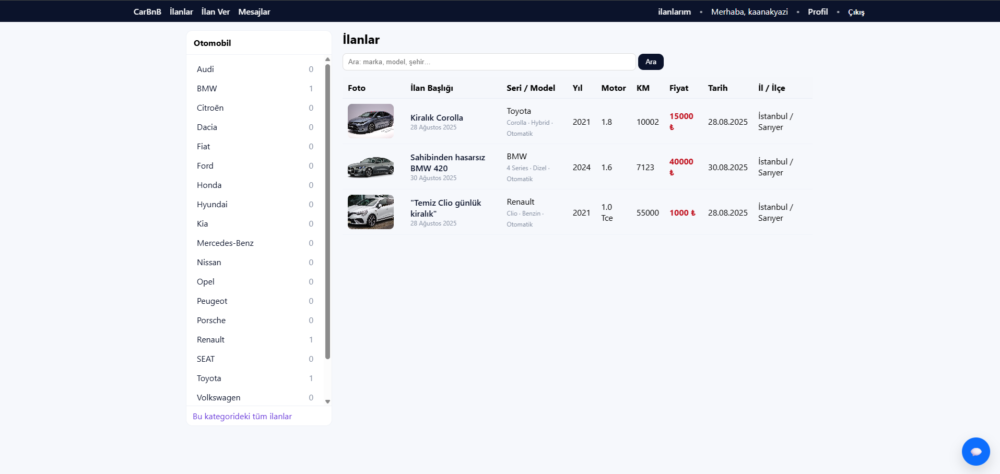
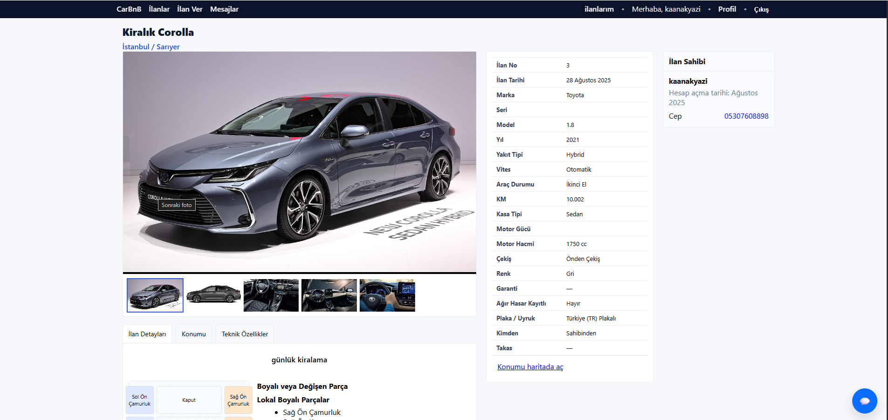
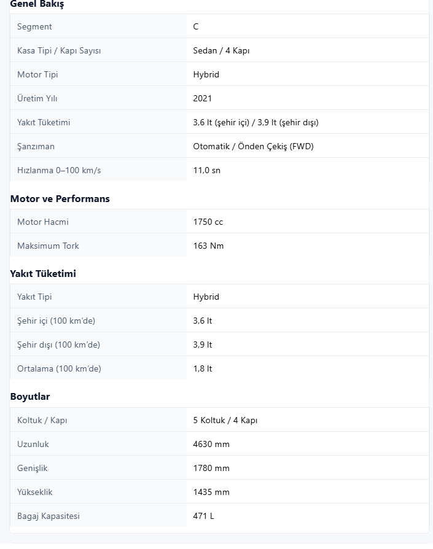
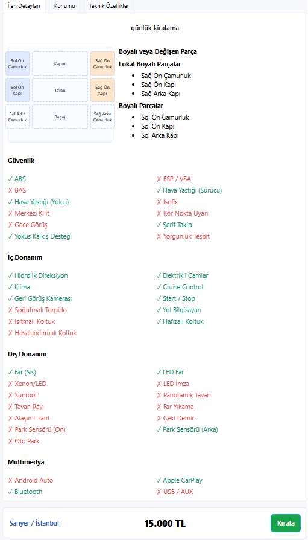
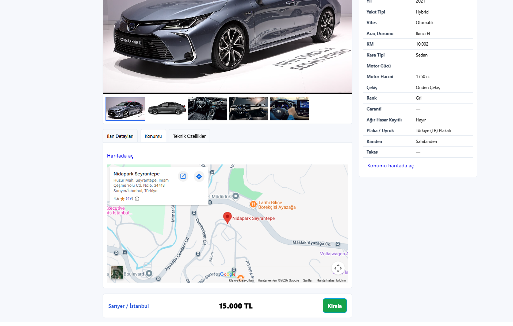
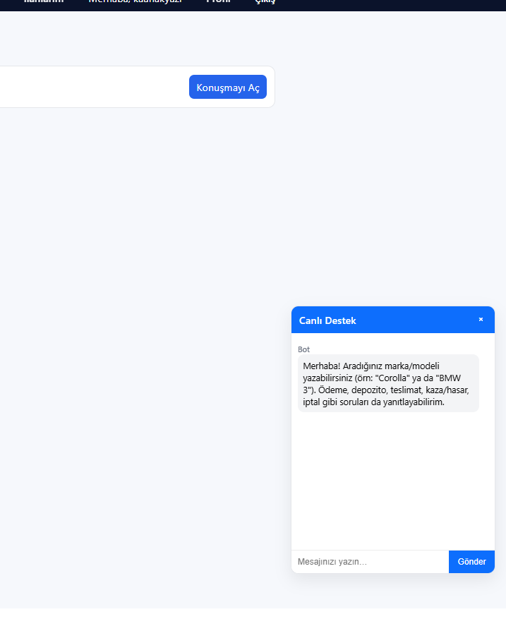

# Carbnb

Django ile geliştirilmiş, Airbnb'nin araç kiralama versiyonu gibi çalışan bir
web platformu. Kullanıcılar araç ilanı verebilir, ilanları filtreleyip
rezervasyon yapabilir ve ilan sahibiyle uygulama içi mesajlaşabilir.

| İlan Listesi | İlan Detayı |
|---|---|
|  |  |

| Teknik Özellikler | Boya/Hasar & Donanım |
|---|---|
|  |  |

| Konum | Canlı Destek |
|---|---|
|  |  |

## Özellikler

- **Kullanıcı sistemi**: Google ile giriş dahil (django-allauth), profil,
  telefon doğrulama, kullanıcı puanlama ve yorum sistemi
- **Araç ilanları**: Marka/model, yakıt tipi, vites, kasa tipi, renk, km,
  konum (enlem/boylam), boya-hasar durumu ve günlük fiyat bilgisiyle
  detaylı araç ilanları
- **Rezervasyon sistemi**: Tarih aralığına göre araç kiralama, durum takibi
  (beklemede / ödendi / iptal)
- **Uygulama içi mesajlaşma**: Kiracı ve ilan sahibi arasında 1-1 chat
- **Çoklu araç fotoğrafı** desteği

## Proje Yapısı

```
accounts/     # Kullanıcı profili, kimlik doğrulama, yorum/puanlama
cars/         # Araç ilanları, özellikler, hasar/boya durumu
bookings/     # Rezervasyon mantığı
chat/         # Kullanıcılar arası mesajlaşma
common/       # Ortak yardımcı bileşenler
core/         # Ana sayfa ve genel görünümler
config/       # Django proje ayarları
```

## Kurulum

```bash
python -m venv .venv
.venv\Scripts\activate      # Windows
pip install -r requirements.txt

copy .env.example .env      # ve DJANGO_SECRET_KEY değerini kendi anahtarınla değiştir

python manage.py migrate
```

## Çalıştırma

```bash
python manage.py runserver
```

Uygulama `http://127.0.0.1:8000` adresinde çalışır.

## Kullanılan Teknolojiler

- Python, Django
- django-allauth — kimlik doğrulama ve Google ile giriş
- SQLite — veritabanı (geliştirme ortamı)
- Pillow — görsel işleme
- python-dotenv — ortam değişkeni yönetimi

## Not

Bu depoda örnek/test verisi (`db.sqlite3`) ve kullanıcı kimlik belgesi
görselleri gizlilik nedeniyle paylaşılmamıştır. `media/car_photos` altındaki
görseller yalnızca geliştirme sürecinde arayüzü test etmek için kullanılmıştır.
